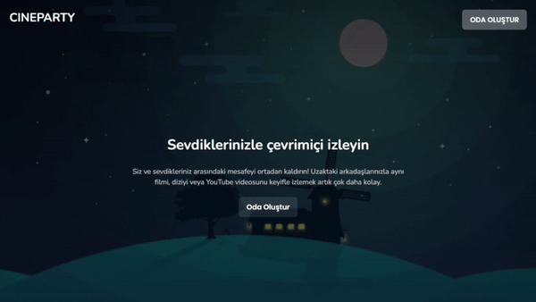
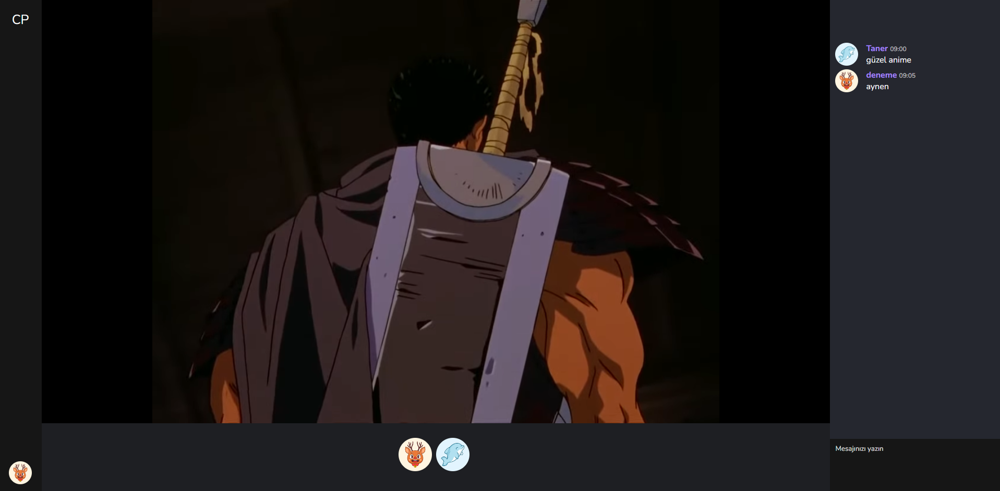

# Vue Watch Party

Vue Watch Party is a web application that enables synchronized YouTube video viewing for multiple users. Built with Vue.js and Nuxt 3, it provides a seamless experience for watching videos together in real-time.

## Features

- **Synchronized Playback**: Ensures all participants watch the same video simultaneously.
- **Real-time Chat**: Facilitates communication among users during video sessions.
- **User Authentication**: Supports secure login and registration processes.
- **MongoDB Integration**: Stores user data, session information, and chat messages in a secure and scalable database.

## Technologies Used

- **Vue.js**: A progressive JavaScript framework for building user interfaces.
- **Nuxt 3**: A framework for creating Vue.js applications with server-side rendering capabilities.
- **Socket.IO**: Enables real-time, bidirectional communication between web clients and servers.
- **YouTube IFrame Player API**: Integrates YouTube videos into the application with control over playback.
- **MongoDB**: A NoSQL database for managing application data efficiently.

## Installation

1. **Clone the repository**:

   ```bash
   git clone https://github.com/utaner/vue-watch-party.git
   cd vue-watch-party
   
## Preview



   
